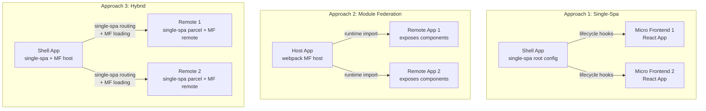

# Design Document: Micro Frontend Deep Dive

## Overview

This project is a hands-on learning repository structured as three independent implementations of micro frontend architecture, each in its own directory. The goal is to give an experienced developer deep, interview-ready understanding of Single-Spa, Module Federation, and a Hybrid approach by building working examples with heavily annotated code.

The project is not a production application — it is a teaching tool. Every configuration file, component, and utility is annotated with inline comments explaining the "why" behind each decision. Each approach directory is self-contained and runnable independently.

**Technology Stack:**
- React 18 as the primary UI framework (used across all micro frontends for simplicity — the concepts transfer to any framework)
- Webpack 5 as the bundler (required for Module Federation, used consistently across all three approaches)
- JavaScript/JSX (not TypeScript — keeps the focus on architecture, not type gymnastics)
- Node.js for local development servers

**Directory Structure:**
```
Single-Spa/           # Approach 1: Orchestration-based micro frontends
ModuleFederation/     # Approach 2: Runtime code sharing micro frontends
Hybrid/               # Approach 3: Combined orchestration + code sharing
docs/                 # Cross-cutting learning modules (communication, CSS, testing, interview guide)
```

## Architecture

### High-Level Architecture

Each approach follows a shell + micro-frontend pattern, but the mechanism for loading and orchestrating micro frontends differs:



### Single-Spa Architecture (Approach 1)

Single-Spa acts as an orchestrator. The shell app (root config) registers micro frontends and manages their lifecycles. Each micro frontend exports `bootstrap`, `mount`, and `unmount` functions. The shell decides which micro frontend is active based on URL routing.

```
Single-Spa/
├── root-config/          # Shell app — the orchestrator
│   ├── src/
│   │   └── index.js      # registerApplication() calls
│   ├── index.ejs          # HTML template with import map
│   ├── webpack.config.js  # Annotated webpack config
│   └── package.json
├── app-react-home/       # Micro frontend 1 — Home page
│   ├── src/
│   │   ├── root.component.js
│   │   └── app-name.js    # Lifecycle hooks (bootstrap, mount, unmount)
│   ├── webpack.config.js
│   └── package.json
├── app-react-dashboard/  # Micro frontend 2 — Dashboard page
│   ├── src/
│   │   ├── root.component.js
│   │   └── app-name.js
│   ├── webpack.config.js
│   └── package.json
└── README.md             # Foundational concepts + Single-Spa interview prep
```

**Key mechanism:** SystemJS import maps resolve module URLs at runtime. The shell loads micro frontends as SystemJS modules and calls their lifecycle hooks.

### Module Federation Architecture (Approach 2)

Module Federation uses Webpack 5's `ModuleFederationPlugin` to let apps share code at runtime. The host app declares which remotes it consumes; each remote declares which modules it exposes.

```
ModuleFederation/
├── host-app/             # Host — consumes remote components
│   ├── src/
│   │   ├── App.js
│   │   ├── index.js
│   │   └── bootstrap.js  # Async boundary for shared deps
│   ├── webpack.config.js  # ModuleFederationPlugin config
│   └── package.json
├── remote-products/      # Remote 1 — exposes ProductList component
│   ├── src/
│   │   ├── ProductList.js
│   │   ├── App.js
│   │   └── bootstrap.js
│   ├── webpack.config.js
│   └── package.json
├── remote-cart/          # Remote 2 — exposes Cart component
│   ├── src/
│   │   ├── Cart.js
│   │   ├── App.js
│   │   └── bootstrap.js
│   ├── webpack.config.js
│   └── package.json
└── README.md             # Module Federation concepts + interview prep
```

**Key mechanism:** Webpack's `ModuleFederationPlugin` creates a container interface. At runtime, the host fetches `remoteEntry.js` from each remote, which provides a `get()` function to load exposed modules. Shared dependencies are negotiated at runtime — if the host already has React loaded, remotes reuse it.

### Hybrid Architecture (Approach 3)

The Hybrid approach uses Single-Spa for lifecycle orchestration and routing, but loads micro frontend code via Module Federation instead of SystemJS. This gives you Single-Spa's clean lifecycle management with Module Federation's superior code sharing.

```
Hybrid/
├── shell/                # Shell — single-spa root + MF host
│   ├── src/
│   │   ├── index.js       # single-spa registerApplication()
│   │   ├── bootstrap.js
│   │   └── mf-loader.js   # Loads MF remotes as single-spa apps
│   ├── webpack.config.js   # Both single-spa and MF config
│   └── package.json
├── mf-home/              # Micro frontend 1 — MF remote + single-spa lifecycle
│   ├── src/
│   │   ├── App.js
│   │   ├── bootstrap.js
│   │   └── single-spa-entry.js  # Exports lifecycle hooks
│   ├── webpack.config.js
│   └── package.json
├── mf-settings/          # Micro frontend 2 — MF remote + single-spa lifecycle
│   ├── src/
│   │   ├── App.js
│   │   ├── bootstrap.js
│   │   └── single-spa-entry.js
│   ├── webpack.config.js
│   └── package.json
└── README.md             # Hybrid concepts + interview prep
```

**Key mechanism:** The shell's `mf-loader.js` dynamically imports a remote's single-spa lifecycle entry via Module Federation's `import()` syntax. Single-Spa handles when to mount/unmount; Module Federation handles how to load the code.


## Components and Interfaces

### 1. Single-Spa Components

#### Root Config (Shell App)
- **Purpose:** Orchestrates all micro frontends, owns top-level routing
- **Key file:** `src/index.js` — calls `registerApplication()` for each micro frontend
- **Interface:** Each registered app must export `{ bootstrap, mount, unmount }` lifecycle functions
- **Routing:** Uses `activeWhen` parameter (e.g., `activeWhen: ['/home']`) to match URL paths to apps

#### Micro Frontend Apps (Home, Dashboard)
- **Purpose:** Self-contained React apps that render into a DOM container provided by the shell
- **Key file:** `src/app-name.js` — exports lifecycle hooks wrapping `single-spa-react`
- **Interface:**
  ```js
  // Each micro frontend exports these three functions
  export const bootstrap = lifecycles.bootstrap; // Called once, on first load
  export const mount = lifecycles.mount;         // Called each time the app activates
  export const unmount = lifecycles.unmount;     // Called when navigating away
  ```

### 2. Module Federation Components

#### Host App
- **Purpose:** Entry point that consumes components from remote apps
- **Key file:** `webpack.config.js` — `ModuleFederationPlugin` with `remotes` config
- **Interface:** Uses dynamic `import()` to load remote components
  ```js
  // Host webpack config declares remotes
  remotes: {
    remoteProducts: 'remoteProducts@http://localhost:3001/remoteEntry.js',
    remoteCart: 'remoteCart@http://localhost:3002/remoteEntry.js',
  }
  ```

#### Remote Apps (Products, Cart)
- **Purpose:** Independently deployed apps that expose components for consumption
- **Key file:** `webpack.config.js` — `ModuleFederationPlugin` with `exposes` config
- **Interface:**
  ```js
  // Remote webpack config exposes modules
  exposes: {
    './ProductList': './src/ProductList',
  }
  ```

#### Async Boundary (bootstrap.js)
- **Purpose:** Required pattern for Module Federation — the real app entry is loaded asynchronously so shared dependencies can be negotiated before any code runs
- **Pattern:** `index.js` does `import('./bootstrap')`, and `bootstrap.js` contains the actual `ReactDOM.render()` call

### 3. Hybrid Components

#### Shell (Single-Spa + MF Host)
- **Purpose:** Combines Single-Spa's `registerApplication()` with Module Federation's `remotes`
- **Key file:** `src/mf-loader.js` — bridge that loads MF remotes and wraps them as single-spa lifecycle objects
- **Interface:**
  ```js
  // mf-loader.js — the bridge between Single-Spa and Module Federation
  export function loadMFApp(remoteName, modulePath) {
    return async () => {
      const module = await import(`${remoteName}/${modulePath}`);
      return module; // Must export { bootstrap, mount, unmount }
    };
  }
  ```

#### Hybrid Micro Frontends (Home, Settings)
- **Purpose:** React apps that are both MF remotes (expose modules) and single-spa apps (export lifecycle hooks)
- **Key file:** `src/single-spa-entry.js` — wraps the React component with `single-spa-react` and exports lifecycle hooks
- **Dual interface:** Exposed via MF's `exposes` config AND exports single-spa lifecycle hooks

### 4. Cross-Cutting Components (docs/)

#### Communication Patterns Module
- **Purpose:** Demonstrates three inter-micro-frontend communication patterns
- **Patterns implemented:**
  1. **Custom Events:** `dispatchEvent(new CustomEvent('cart:updated', { detail }))` — loosely coupled, browser-native
  2. **Event Bus (Pub/Sub):** Shared `EventBus` class with `subscribe(event, callback)` and `publish(event, data)` — decoupled but requires shared reference
  3. **Shared State Store:** Simple observable store with `getState()`, `setState()`, `subscribe()` — tightest coupling but most powerful

#### CSS Isolation Module
- **Purpose:** Demonstrates three CSS isolation techniques
- **Techniques:**
  1. **CSS Modules:** Webpack `css-loader` with `modules: true` — scoped class names at build time
  2. **Shadow DOM:** `element.attachShadow({ mode: 'open' })` — browser-native encapsulation
  3. **BEM with App Prefixes:** Convention-based (e.g., `.mf-products__card--active`) — no tooling required

#### Testing Module
- **Purpose:** Demonstrates testing at three levels
- **Levels:**
  1. **Unit:** Jest + React Testing Library for individual micro frontend components
  2. **Integration:** Testing communication between micro frontends using a shared test harness
  3. **End-to-End:** Cypress testing the composed application

#### Interview Preparation Guide
- **Purpose:** Consolidated decision matrix, scenario questions, and cheat sheet
- **Format:** Markdown document with tables, Q&A sections, and quick-reference cards

## Data Models

This project is a learning tool, not a data-driven application. The "data models" are the configuration structures and communication contracts between micro frontends.

### Single-Spa Registration Model
```js
// The shape of a single-spa app registration
{
  name: 'app-react-home',           // Unique app identifier
  app: () => System.import('app-react-home'), // How to load the app
  activeWhen: ['/home'],             // URL paths that activate this app
  customProps: { domElement: '#app-container' } // Props passed to lifecycle hooks
}
```

### Module Federation Plugin Config Model
```js
// The shape of ModuleFederationPlugin options
{
  name: 'remoteProducts',           // Unique container name
  filename: 'remoteEntry.js',       // Output filename for the container
  exposes: {                        // Modules this remote shares
    './ProductList': './src/ProductList'
  },
  remotes: {                        // Containers this host consumes (host only)
    remoteCart: 'remoteCart@http://localhost:3002/remoteEntry.js'
  },
  shared: {                         // Dependencies shared across containers
    react: { singleton: true, requiredVersion: '^18.0.0' },
    'react-dom': { singleton: true, requiredVersion: '^18.0.0' }
  }
}
```

### Communication Contracts

#### Custom Event Contract
```js
// Event shape for cross-micro-frontend communication
{
  type: 'cart:item-added',          // Namespaced event name
  detail: {                         // Event payload
    productId: 'string',
    quantity: 'number'
  }
}
```

#### Shared State Store Contract
```js
// Store interface
{
  getState: () => Object,           // Returns current state snapshot
  setState: (partial) => void,      // Merges partial state update
  subscribe: (listener) => unsubscribe // Registers change listener, returns cleanup
}
```

### Shared Dependencies Configuration Model
```js
// Shared dependency strategies demonstrated in the project
{
  // Singleton: only one version loaded, host wins
  react: { singleton: true, requiredVersion: '^18.0.0' },

  // Version range: compatible versions share, incompatible get their own copy
  lodash: { requiredVersion: '^4.17.0' },

  // Eager: loaded immediately with the host, not negotiated at runtime
  'react-dom': { singleton: true, eager: true, requiredVersion: '^18.0.0' }
}
```


## Correctness Properties

*A property is a characteristic or behavior that should hold true across all valid executions of a system — essentially, a formal statement about what the system should do. Properties serve as the bridge between human-readable specifications and machine-verifiable correctness guarantees.*

The following properties are derived from the acceptance criteria. Many requirements in this project are documentation/content requirements (e.g., "include an interview section") which are not amenable to property-based testing. The properties below focus on the functional, testable behaviors of the micro frontend implementations.

### Property 1: Shell routing activates the correct micro frontend

*For any* set of registered micro frontend applications with defined `activeWhen` paths, navigating to a URL that matches an app's `activeWhen` should result in that app being mounted and no other app being mounted.

**Validates: Requirements 2.2, 7.2**

### Property 2: Lifecycle hooks execute in the correct order

*For any* micro frontend managed by Single-Spa, the lifecycle hooks must be invoked in the order: `bootstrap` (once, on first activation), then `mount` (on each activation), then `unmount` (on each deactivation). `mount` must never be called before `bootstrap` has completed, and `unmount` must only be called on a currently mounted app.

**Validates: Requirements 2.3**

### Property 3: DOM cleanup on unmount

*For any* micro frontend that has been mounted and then unmounted, the DOM container assigned to that micro frontend should contain no child elements after unmount completes.

**Validates: Requirements 2.4**

### Property 4: Host dynamically loads remote components

*For any* remote component configured in the Module Federation host's `remotes` config, the host should be able to import and render that component at runtime without a rebuild of the host application.

**Validates: Requirements 3.2**

### Property 5: Singleton shared dependencies load only once

*For any* dependency marked as `singleton: true` in the shared configuration, only one instance of that dependency should exist at runtime across all micro frontends, regardless of whether the setup is Module Federation or Hybrid.

**Validates: Requirements 3.3, 4.3**

### Property 6: Fallback UI on remote failure

*For any* remote application that fails to load (network error, unavailable server), the host application should render a fallback UI component instead of throwing an unhandled error or showing a blank screen.

**Validates: Requirements 3.4**

### Property 7: Hybrid bridge loads MF remotes as single-spa apps

*For any* micro frontend in the Hybrid setup, the `mf-loader` bridge should successfully load the remote's code via Module Federation and return a valid single-spa lifecycle object (with `bootstrap`, `mount`, and `unmount` functions).

**Validates: Requirements 4.2**

### Property 8: Custom event dispatch and receive

*For any* custom event dispatched by one micro frontend with a given event type and payload, all other micro frontends that have registered a listener for that event type should receive the exact same payload.

**Validates: Requirements 5.2**

### Property 9: Shared state update propagates to all subscribers

*For any* state update applied to the shared store, all currently subscribed listeners should be notified with the new state, and `getState()` should return the updated state.

**Validates: Requirements 5.3**

### Property 10: Dependency version conflict resolution follows configured strategy

*For any* two micro frontends that declare different versions of the same shared dependency, the runtime resolution should follow the configured strategy: singleton mode loads only the host's version; version-range mode loads a compatible version if available, or separate copies if not.

**Validates: Requirements 6.2**

### Property 11: App-level routing isolation

*For any* micro frontend that manages its own internal sub-routes, navigating between sub-routes within that micro frontend should not trigger mount or unmount of any other micro frontend.

**Validates: Requirements 7.3**

### Property 12: CSS isolation prevents cross-micro-frontend style bleed

*For any* two micro frontends that define styles with the same CSS class name, the computed styles of elements in one micro frontend should not be affected by the styles defined in the other micro frontend.

**Validates: Requirements 8.2**

## Error Handling

### Remote Loading Failures (Module Federation & Hybrid)
- **Strategy:** React Error Boundaries wrapping each remote component import
- **Behavior:** When a `React.lazy(() => import('remote/Component'))` fails, the Error Boundary catches it and renders a fallback UI (e.g., "This section is temporarily unavailable")
- **Implementation:** Each remote import is wrapped in a `<Suspense>` for loading states and an `<ErrorBoundary>` for failure states
- **Retry:** Optional retry button in the fallback UI that re-attempts the dynamic import

### Lifecycle Hook Failures (Single-Spa & Hybrid)
- **Strategy:** Single-Spa has built-in error handling — if a lifecycle hook throws, single-spa fires an error event and the app enters an error state
- **Behavior:** Register a global error handler via `addErrorHandler()` that logs the error and optionally shows a user-facing message
- **DOM Cleanup:** If mount fails, ensure partial DOM is cleaned up to prevent ghost elements

### Shared Dependency Conflicts
- **Strategy:** Webpack's shared config with `strictVersion: false` (default) allows graceful fallback to loading a separate copy if versions are incompatible
- **Behavior:** Log a console warning when a fallback copy is loaded so developers can identify unintended duplication
- **Prevention:** Use `requiredVersion` ranges (e.g., `'^18.0.0'`) rather than exact versions to maximize sharing

### Communication Failures
- **Custom Events:** Events are fire-and-forget — no error if no listener exists. Document this as a trade-off.
- **Event Bus:** The pub/sub implementation should catch and log errors thrown by individual subscribers without stopping propagation to other subscribers
- **Shared Store:** `setState` should validate input (must be an object) and throw a descriptive error for invalid updates

## Testing Strategy

### Dual Testing Approach

This project uses both unit tests and property-based tests for comprehensive coverage.

**Unit Tests (Jest + React Testing Library):**
- Test specific examples, edge cases, and error conditions
- Focus on: component rendering, lifecycle hook behavior, error boundary fallbacks, specific routing scenarios
- Keep unit test count lean — property tests handle broad input coverage

**Property-Based Tests (fast-check):**
- Test universal properties across many generated inputs
- Each property test runs a minimum of 100 iterations
- Each test is tagged with: `Feature: micro-frontend-deep-dive, Property {N}: {title}`
- Library: [fast-check](https://github.com/dubzzz/fast-check) — mature, well-maintained JS property testing library

### Test Organization

```
Single-Spa/
├── __tests__/
│   ├── routing.test.js          # Property 1: shell routing
│   ├── lifecycle.test.js        # Property 2: lifecycle ordering, Property 3: DOM cleanup
│   └── unit/
│       └── root-config.test.js  # Unit tests for registration logic

ModuleFederation/
├── __tests__/
│   ├── remote-loading.test.js   # Property 4: dynamic loading, Property 6: fallback UI
│   ├── shared-deps.test.js      # Property 5: singleton deps, Property 10: version resolution
│   └── unit/
│       └── host-app.test.js     # Unit tests for host configuration

Hybrid/
├── __tests__/
│   ├── mf-loader.test.js        # Property 7: hybrid bridge
│   └── unit/
│       └── shell.test.js        # Unit tests for shell integration

docs/
├── __tests__/
│   ├── communication.test.js    # Property 8: events, Property 9: shared state
│   ├── css-isolation.test.js    # Property 12: style isolation
│   ├── routing.test.js          # Property 11: app-level routing isolation
│   └── unit/
│       └── event-bus.test.js    # Unit tests for event bus edge cases
```

### Property Test Implementation Pattern

Each property test follows this structure:

```js
import fc from 'fast-check';

// Feature: micro-frontend-deep-dive, Property 8: Custom event dispatch and receive
describe('Property 8: Custom event dispatch and receive', () => {
  it('should deliver the exact payload to all listeners', () => {
    fc.assert(
      fc.property(
        fc.string(),           // event type
        fc.jsonValue(),        // event payload
        fc.integer({ min: 1, max: 10 }), // number of listeners
        (eventType, payload, listenerCount) => {
          // Setup listeners, dispatch event, verify all received exact payload
        }
      ),
      { numRuns: 100 }
    );
  });
});
```

### What Gets Tested Where

| Property | Approach | Test Type | Key Assertion |
|----------|----------|-----------|---------------|
| 1. Shell routing | Single-Spa | Property | Correct app mounts for matching URL |
| 2. Lifecycle order | Single-Spa | Property | bootstrap → mount → unmount ordering |
| 3. DOM cleanup | Single-Spa | Property | No children after unmount |
| 4. Remote loading | Module Fed | Property | Component renders from remote |
| 5. Singleton deps | Module Fed + Hybrid | Property | One instance per singleton dep |
| 6. Fallback UI | Module Fed | Property | Error boundary renders fallback |
| 7. Hybrid bridge | Hybrid | Property | MF remote returns valid lifecycle |
| 8. Event dispatch | Cross-cutting | Property | All listeners get exact payload |
| 9. Shared state | Cross-cutting | Property | All subscribers get updated state |
| 10. Version resolution | Module Fed | Property | Strategy determines loaded version |
| 11. Routing isolation | Cross-cutting | Property | Sub-navigation doesn't affect others |
| 12. CSS isolation | Cross-cutting | Property | Same class name, no style bleed |
