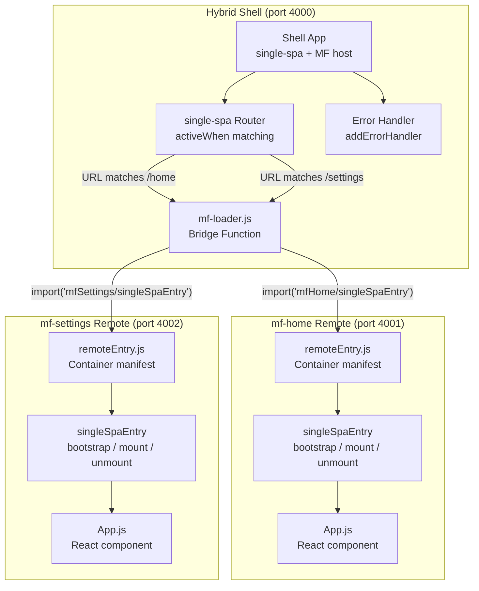
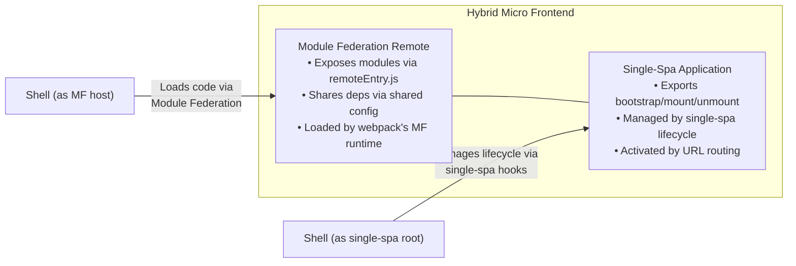
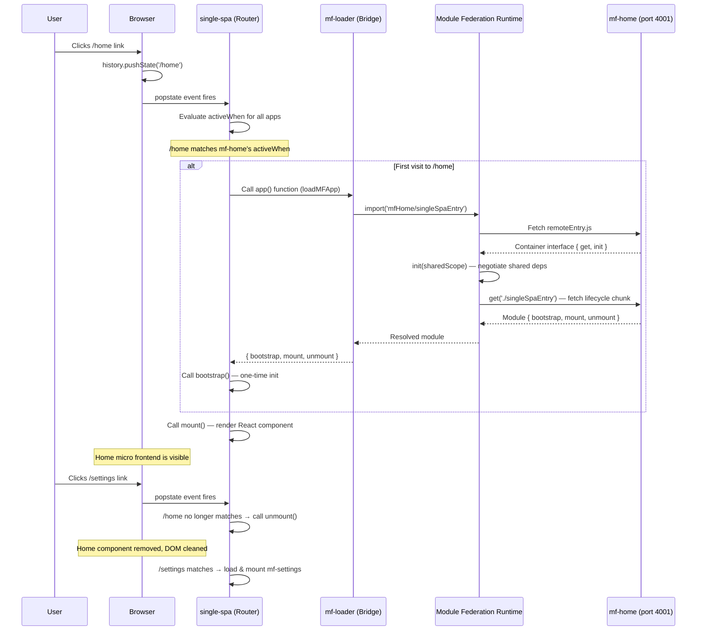
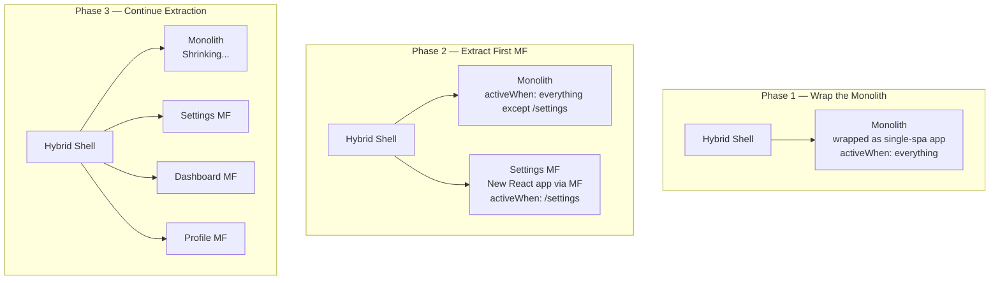

# Hybrid Micro Frontend Architecture (Single-Spa + Module Federation)

## Table of Contents

- [Why Combine Single-Spa and Module Federation?](#why-combine-single-spa-and-module-federation)
- [Architecture Overview](#architecture-overview)
- [The mf-loader Bridge Pattern](#the-mf-loader-bridge-pattern)
- [How the Hybrid Loading Flow Works](#how-the-hybrid-loading-flow-works)
- [Shared Dependency Management in the Hybrid Approach](#shared-dependency-management-in-the-hybrid-approach)
- [Error Handling — Three Layers Deep](#error-handling--three-layers-deep)
- [Migration Strategies: Monolith to Micro Frontends](#migration-strategies-monolith-to-micro-frontends)
- [When the Hybrid Approach is Appropriate](#when-the-hybrid-approach-is-appropriate)
- [Trade-Offs: Hybrid vs Single-Spa vs Module Federation](#trade-offs-hybrid-vs-single-spa-vs-module-federation)
- [Interview Preparation: Hybrid Architecture](#interview-preparation-hybrid-architecture)

---

## Why Combine Single-Spa and Module Federation?

Single-Spa and Module Federation solve different problems. Single-Spa is an orchestrator — it manages *when* micro frontends mount and unmount based on URL routing, and it provides explicit lifecycle hooks (`bootstrap`, `mount`, `unmount`) for fine-grained control. Module Federation is a code loader — it manages *how* micro frontend code gets loaded at runtime, with automatic shared dependency negotiation so you don't ship React five times.

Used alone, each has a gap:

**Single-Spa alone** (see `Single-Spa/` directory):
- Uses SystemJS + import maps for code loading
- No built-in dependency sharing — each micro frontend bundles its own React unless you manually configure CDN externals
- Requires maintaining import maps in the HTML template
- Adds SystemJS as a runtime dependency (~15KB)

**Module Federation alone** (see `ModuleFederation/` directory):
- Excellent runtime code sharing via the `shared` config
- No lifecycle management — components load via `React.lazy()` and unmount via React's normal reconciliation
- No centralized error handling at the orchestration level
- No explicit mount/unmount hooks for cleanup verification

**The Hybrid approach combines both:**
- Single-Spa handles orchestration: routing, lifecycle management, centralized error handling
- Module Federation handles code loading: dynamic imports from remote containers, shared dependency negotiation
- The `mf-loader.js` bridge connects them — it loads MF remotes and returns single-spa lifecycle objects
- SystemJS is eliminated entirely — Module Federation replaces it as the module loading mechanism

The result: you get Single-Spa's clean lifecycle model *and* Module Federation's zero-duplication dependency sharing, without the downsides of either approach used alone.

---

## Architecture Overview

### Directory Structure

```
Hybrid/
├── shell/                    # Shell app — single-spa orchestrator + MF host
│   ├── src/
│   │   ├── index.js          # Async boundary (import('./bootstrap'))
│   │   ├── bootstrap.js      # registerApplication() calls + error handling
│   │   └── mf-loader.js      # THE BRIDGE — loads MF remotes as single-spa apps
│   ├── public/
│   │   └── index.html        # Nav bar + micro frontend mount container
│   ├── webpack.config.js     # ModuleFederationPlugin (remotes) + HtmlWebpackPlugin
│   └── package.json
├── mf-home/                  # Micro frontend 1 — MF remote + single-spa lifecycle
│   ├── src/
│   │   ├── index.js          # Async boundary for standalone mode
│   │   ├── bootstrap.js      # Standalone entry (ReactDOM.createRoot)
│   │   ├── App.js            # React component (the actual UI)
│   │   └── single-spa-entry.js  # Lifecycle hooks (bootstrap, mount, unmount)
│   ├── public/
│   │   └── index.html        # Standalone HTML (not used by shell)
│   ├── webpack.config.js     # ModuleFederationPlugin (exposes singleSpaEntry)
│   └── package.json
├── mf-settings/              # Micro frontend 2 — same pattern as mf-home
│   ├── src/
│   │   ├── index.js
│   │   ├── bootstrap.js
│   │   ├── App.js
│   │   └── single-spa-entry.js
│   ├── webpack.config.js
│   └── package.json
└── README.md                 # ← You are here
```

### High-Level Architecture Diagram



### The Dual Nature of Hybrid Micro Frontends

Each micro frontend in the Hybrid setup has a dual identity:



This dual nature is what makes the Hybrid approach powerful — and what makes it worth understanding for interviews. The micro frontend doesn't know or care which system is calling it. Module Federation loads the code; single-spa manages the lifecycle. Each tool does what it's best at.

---

## The mf-loader Bridge Pattern

The `mf-loader.js` file (`shell/src/mf-loader.js`) is the key innovation of the Hybrid approach. It's a thin adapter that connects two systems that don't know about each other.

### What the Bridge Does

Single-Spa's `registerApplication()` expects an `app` parameter — a function that returns a Promise resolving to `{ bootstrap, mount, unmount }`. In pure Single-Spa, this function uses SystemJS:

```js
// Pure Single-Spa (Single-Spa/root-config/src/index.js)
app: () => System.import('app-react-home')
```

In the Hybrid approach, the bridge replaces SystemJS with Module Federation:

```js
// Hybrid (shell/src/bootstrap.js)
app: loadMFApp('mfHome', 'singleSpaEntry')
```

The `loadMFApp()` function returns a lazy-loading function that:

1. Uses Module Federation's `import()` to fetch the remote module
2. Module Federation handles `remoteEntry.js` loading, `init()` for shared deps, and `get()` for the module
3. The remote module exports `{ bootstrap, mount, unmount }` — exactly what single-spa needs
4. Single-Spa receives the lifecycle hooks and manages them as usual

### The Bridge Code (Simplified)

```js
// shell/src/mf-loader.js — the complete bridge function
export function loadMFApp(remoteName, modulePath) {
  return async () => {
    // Module Federation intercepts this import() at build time.
    // At runtime, it fetches remoteEntry.js, negotiates shared deps,
    // and loads the specific module from the remote container.
    const module = await import(`${remoteName}/${modulePath}`);
    return module; // { bootstrap, mount, unmount }
  };
}
```

That's it. The bridge is intentionally minimal — it's just a translation layer. The full annotated version is in `shell/src/mf-loader.js` with detailed comments explaining every aspect.

### Why Return a Function (Lazy Loading)

The bridge returns a *function* that returns a Promise, not a Promise directly. This is critical for performance:

```js
// LAZY — code loads only when the user navigates to /home
app: loadMFApp('mfHome', 'singleSpaEntry')  // Returns a function

// EAGER — code loads immediately on page load (wasteful)
app: loadMFApp('mfHome', 'singleSpaEntry')() // Returns a Promise (DON'T do this)
```

Single-Spa calls the function only when the URL matches the app's `activeWhen` condition. If the user never visits `/settings`, the Settings micro frontend's code is never fetched. This is the same lazy-loading pattern used in pure Single-Spa with `() => System.import(...)`.

### How the Bridge Connects to Registration

In `shell/src/bootstrap.js`, the bridge is used in `registerApplication()` calls:

```js
import { registerApplication, start } from 'single-spa';
import { loadMFApp } from './mf-loader';

registerApplication({
  name: 'mf-home',
  app: loadMFApp('mfHome', 'singleSpaEntry'),   // MF loading
  activeWhen: ['/home'],                          // single-spa routing
  customProps: { domElement: '#micro-frontend-container' },
});

registerApplication({
  name: 'mf-settings',
  app: loadMFApp('mfSettings', 'singleSpaEntry'), // MF loading
  activeWhen: ['/settings'],                        // single-spa routing
  customProps: { domElement: '#micro-frontend-container' },
});

start();
```

The pattern is identical to pure Single-Spa registration — the only difference is the `app` function. Single-Spa doesn't know Module Federation exists. Module Federation doesn't know single-spa exists. The bridge is the only code that knows about both.

---

## How the Hybrid Loading Flow Works

Here's the complete step-by-step flow when a user navigates to `/home` in the Hybrid shell:



### Key Observations

1. **Bootstrap is called once.** The first time a user visits `/home`, single-spa calls `bootstrap()` then `mount()`. On subsequent visits, only `mount()` is called — the app stays bootstrapped in memory.

2. **Unmount happens before mount.** Single-Spa guarantees the outgoing app is fully cleaned up before the incoming app starts rendering. This prevents DOM conflicts.

3. **Module Federation loading is transparent.** From single-spa's perspective, the `app` function returned a Promise with lifecycle hooks. It doesn't know those hooks came from a remote webpack container.

4. **Shared deps are negotiated once.** The `init(sharedScope)` call happens when `remoteEntry.js` first loads. On subsequent navigations, the container is already initialized — no re-negotiation needed.

---

## Shared Dependency Management in the Hybrid Approach

One of the biggest advantages of the Hybrid approach over pure Single-Spa is automatic shared dependency management via Module Federation.

### What Gets Shared

In the Hybrid setup, three dependencies are shared as singletons across the shell and all remotes (see `shell/webpack.config.js`):

```js
shared: {
  react:       { singleton: true, requiredVersion: '^18.0.0' },
  'react-dom': { singleton: true, requiredVersion: '^18.0.0' },
  'single-spa': { singleton: true, requiredVersion: '^5.9.0' },
}
```

### Why `single-spa` Must Be a Singleton

This is unique to the Hybrid approach. In pure Module Federation, you don't share `single-spa` because it's not used. In the Hybrid setup, both the shell and the remotes import `single-spa` (the shell for `registerApplication()`, the remotes for `single-spa-react`).

Single-spa maintains a global registry of registered applications. If the shell and a remote each had their own copy, they'd have separate registries. The shell would register apps in its registry, but the lifecycle hooks in the remote would reference a different registry. Routing would break silently.

`singleton: true` ensures one copy of single-spa across all containers — one registry, one routing engine, one lifecycle manager.

### Comparison: Dependency Sharing Across Approaches

| Approach | Sharing Mechanism | Configuration | Runtime Behavior |
|---|---|---|---|
| **Single-Spa** | SystemJS externals + CDN | Manual — exclude deps from bundle, load from CDN via import map | Each MF must declare externals; CDN must serve correct versions |
| **Module Federation** | `shared` config in ModuleFederationPlugin | Declarative — list deps with version constraints | Automatic negotiation via `init(sharedScope)` at runtime |
| **Hybrid** | Same as Module Federation | Same declarative config, plus `single-spa` as shared singleton | Same automatic negotiation, with single-spa included |

The Hybrid approach inherits Module Federation's sharing mechanism entirely. The only addition is sharing `single-spa` itself — which is necessary because both the shell and remotes depend on it.

---

## Error Handling — Three Layers Deep

The Hybrid approach has the most comprehensive error handling of all three approaches because it combines single-spa's orchestration-level error handling with Module Federation's loading-level error handling.

### Layer 1: Component-Level (single-spa-react Error Boundary)

Each micro frontend's `single-spa-entry.js` includes an `errorBoundary` option (see `mf-home/src/single-spa-entry.js`):

```js
const lifecycles = singleSpaReact({
  React, ReactDOM,
  rootComponent: App,
  errorBoundary(err) {
    return <div>⚠️ Home App Error: {err.message}</div>;
  },
});
```

This catches React rendering errors *inside* the mounted micro frontend. If a component throws during render, the error boundary shows a fallback UI instead of crashing the entire shell.

### Layer 2: Orchestration-Level (single-spa Error Handler)

The shell's `bootstrap.js` registers a global error handler (see `shell/src/bootstrap.js`):

```js
addErrorHandler(function (error) {
  console.error('[Hybrid Shell Error]', error.appOrParcelName, error.message);
  // Emergency DOM cleanup
  const container = document.getElementById('micro-frontend-container');
  if (container && container.childNodes.length > 0) {
    container.innerHTML = '';
  }
});
```

This catches lifecycle hook failures — if `mount()` or `unmount()` throws, single-spa fires this handler. It also catches Module Federation loading failures, because a failed `import()` in the mf-loader bridge causes the `app` function's Promise to reject, which single-spa treats as a load error.

### Layer 3: Loading-Level (Module Federation Failures)

If a remote is unavailable (server down, network error), the `import()` call in `mf-loader.js` rejects. Single-Spa catches this rejection and:

1. Fires the error handler from Layer 2
2. Puts the app in a `LOAD_ERROR` state
3. Does NOT crash the shell — other micro frontends keep working

### Comparison: Error Handling Across Approaches

| Error Type | Single-Spa | Module Federation | Hybrid |
|---|---|---|---|
| React rendering error | Framework error boundary (if configured) | React Error Boundary + Suspense | single-spa-react errorBoundary (Layer 1) |
| Lifecycle hook failure | `addErrorHandler()` global handler | N/A (no lifecycle hooks) | `addErrorHandler()` (Layer 2) |
| Remote loading failure | SystemJS import error → app enters error state | React Error Boundary catches `React.lazy()` rejection | mf-loader Promise rejects → single-spa error handler (Layer 2 + 3) |
| DOM cleanup failure | Manual verification | N/A (React handles cleanup) | Verification listener + emergency cleanup (Layer 2) |

The Hybrid approach catches errors at the orchestration level *before* React is involved. In pure Module Federation, a failed `React.lazy()` import bubbles up through React's component tree until an Error Boundary catches it. In the Hybrid approach, single-spa catches it at the routing level — centralized, predictable, and framework-agnostic.

---

## Migration Strategies: Monolith to Micro Frontends

The Hybrid approach is particularly well-suited for incremental migration from a monolith because it provides both the orchestration framework (single-spa) for managing legacy and new code side by side, and the code-sharing mechanism (Module Federation) for efficient runtime loading.

### Strategy 1: The Strangler Fig Pattern (Recommended)

Gradually replace the monolith piece by piece, routing between legacy and new micro frontends. The monolith shrinks over time until it's gone.



**Phase 1 — Wrap the monolith (Week 1-2):**
Set up the Hybrid shell. Wrap the entire monolith as a single-spa application using the appropriate adapter (`single-spa-react`, `single-spa-angular`, etc.). The shell routes ALL paths to the monolith. Users notice nothing — the experience is identical.

**Phase 2 — Extract the first micro frontend (Week 3-6):**
Pick a low-risk, well-bounded feature (e.g., settings page). Build it as a new Hybrid micro frontend — an MF remote that exposes single-spa lifecycle hooks. Update the shell to route `/settings` to the new MF and everything else to the monolith. The monolith's router is configured to ignore `/settings`.

**Phase 3 — Establish patterns and scale (Week 6+):**
Extract more features. Each new micro frontend follows the repeatable Hybrid recipe: create an MF remote, expose `singleSpaEntry`, register in the shell. Teams work independently. The monolith shrinks with each extraction.

**Phase 4 — Retire the monolith:**
When the last feature is extracted, deregister the monolith from single-spa. It's gone.

### Strategy 2: Parallel Run (Risk-Averse)

Run the monolith and micro frontends simultaneously, using feature flags to gradually shift traffic from the monolith to the new micro frontends.

1. Both the monolith and the new MF render the same feature
2. A feature flag determines which one the user sees
3. Compare metrics (performance, error rates, user behavior) between the two
4. When confident, remove the monolith's version

This is slower but safer — you can roll back instantly by flipping the flag.

### Strategy 3: Edge-First Extraction

Start by extracting features at the "edges" of the application — pages with minimal shared state and few dependencies on the monolith's internals. Settings pages, help pages, and standalone tools are good candidates. Save tightly coupled features (checkout flow, real-time dashboards) for later, when cross-MF communication patterns are established.

### Why the Hybrid Approach Fits Migration

- **Single-Spa's framework adapters** let you wrap the legacy monolith regardless of its framework (Angular, React, Vue, jQuery)
- **Module Federation's code sharing** means new micro frontends don't duplicate React — they share it with the shell
- **The mf-loader bridge** is generic — it works with any remote that exports lifecycle hooks, so new MFs follow a repeatable pattern
- **Incremental adoption** — you add one MF at a time, each independently deployable, without touching the monolith's code

---

## When the Hybrid Approach is Appropriate

### Good Fit Scenarios

- **You need lifecycle management AND dependency sharing.** This is the core value proposition. If you want single-spa's explicit `bootstrap`/`mount`/`unmount` hooks (for cleanup verification, centralized error handling, controlled initialization) AND Module Federation's automatic singleton sharing (one React for everyone), the Hybrid approach gives you both without compromise.

- **You're migrating from a monolith incrementally.** The Hybrid shell can orchestrate both legacy apps (wrapped with single-spa adapters) and new micro frontends (loaded via Module Federation). Single-Spa handles the cross-framework lifecycle; Module Federation handles efficient code loading for the new apps.

- **You have many micro frontends (5+) that share a framework.** The more micro frontends you have, the more valuable Module Federation's dependency sharing becomes. With 10 React micro frontends, MF ensures one copy of React. Single-Spa ensures each one mounts and unmounts cleanly.

- **You want centralized orchestration-level error handling.** Single-Spa's `addErrorHandler()` catches errors from ALL micro frontends in one place — loading failures, lifecycle failures, everything. In pure Module Federation, error handling is distributed across React Error Boundaries in each component.

- **Your teams need to deploy independently but share infrastructure.** Each micro frontend is an independent MF remote with its own build and deploy pipeline. The shell orchestrates them at runtime. Teams don't coordinate deploys.

### When the Hybrid Approach is NOT the Right Choice

- **Small applications with 2-3 pages.** The Hybrid approach adds two layers of complexity (single-spa + Module Federation). For a small app, a simple React app with code splitting gives you everything you need without the orchestration overhead.

- **All micro frontends are component-level, not page-level.** If you need to embed components from Team A inside Team B's page (not route between separate pages), pure Module Federation's `import('remote/Component')` pattern is simpler. Single-Spa's routing model is page-level — it activates one app per URL path.

- **Your team doesn't have webpack expertise.** Module Federation is a webpack 5 feature with non-trivial configuration. If your team isn't comfortable with webpack, the debugging experience will be painful. Consider pure Single-Spa with SystemJS (simpler module loading) or a higher-level framework like Piral or qiankun.

- **You need server-side rendering (SSR).** Module Federation's runtime negotiation happens in the browser. SSR support exists but is complex and less battle-tested. If SSR is a hard requirement, evaluate carefully before committing to the Hybrid approach.

---

## Trade-Offs: Hybrid vs Single-Spa vs Module Federation

| Dimension | Single-Spa | Module Federation | Hybrid |
|---|---|---|---|
| **Composition model** | Page-level (route-based) | Component-level (import-based) | Page-level with MF loading |
| **Code loading** | SystemJS + import maps | Webpack MF runtime | Webpack MF runtime (no SystemJS) |
| **Dependency sharing** | Manual (CDN externals) | Automatic (`shared` config) | Automatic (`shared` config) |
| **Lifecycle management** | Explicit (bootstrap/mount/unmount) | None (React handles it) | Explicit (bootstrap/mount/unmount) |
| **Error handling** | Orchestration-level (`addErrorHandler`) | Component-level (Error Boundaries) | Both — three layers deep |
| **Framework mixing** | First-class (adapters for React, Angular, Vue) | Possible but awkward | First-class (via single-spa adapters) |
| **Build tool coupling** | Any bundler | Webpack 5 only | Webpack 5 only |
| **Module system** | SystemJS (external dependency) | Webpack native | Webpack native |
| **HTML template complexity** | High (SystemJS scripts + import maps) | Low (plain HTML) | Low (plain HTML, no SystemJS) |
| **Configuration complexity** | Moderate | Moderate | Higher (two systems to configure) |
| **Runtime overhead** | SystemJS (~15KB) + single-spa (~5KB) | MF runtime (built into webpack) | MF runtime + single-spa (~5KB) |
| **Adding a new MF** | Import map entry + registerApplication | Remotes config + React.lazy import | Remotes config + registerApplication + mf-loader |
| **Best for** | Multi-framework, route-based composition | Same-framework, component-level sharing | Lifecycle control + dependency sharing |

---

## Interview Preparation: Hybrid Architecture

### Q1: Explain the Hybrid micro frontend approach. How does it combine Single-Spa and Module Federation, and why would you use both together?

**Model Answer:**

The Hybrid approach uses Single-Spa for orchestration and Module Federation for code loading. Single-Spa manages *when* micro frontends mount and unmount — it owns the routing, lifecycle hooks, and centralized error handling. Module Federation manages *how* micro frontend code gets loaded — it handles dynamic imports from remote webpack containers and negotiates shared dependencies at runtime.

The connection between them is a bridge function called `mf-loader`. When single-spa decides it's time to load a micro frontend (because the URL matches its `activeWhen`), it calls the bridge. The bridge uses Module Federation's `import()` to fetch the remote module, which exports single-spa lifecycle hooks (`bootstrap`, `mount`, `unmount`). Single-spa receives these hooks and manages the lifecycle as usual.

You'd use both together when you need the benefits of each that the other lacks:

- Single-Spa alone uses SystemJS for loading, which has no built-in dependency sharing. If you have 10 micro frontends, you might load React 10 times unless you manually configure CDN externals.
- Module Federation alone has no lifecycle management. Components load via `React.lazy()` and unmount via React's reconciliation. There's no explicit `unmount()` hook for cleanup verification, no centralized error handler, and no framework-agnostic lifecycle model.

The Hybrid approach eliminates SystemJS entirely (Module Federation replaces it), gives you automatic singleton dependency sharing (one React for everyone), AND preserves single-spa's explicit lifecycle management and centralized error handling.

The trade-off is complexity — you have two systems to understand and configure. This is justified when you have enough micro frontends (5+) that dependency sharing matters, and when you need the operational benefits of explicit lifecycle management (cleanup verification, centralized error handling, controlled initialization).

### Q2: Walk me through the mf-loader bridge pattern. How does it connect Single-Spa and Module Federation?

**Model Answer:**

The mf-loader bridge is a function that translates between Single-Spa's expectations and Module Federation's capabilities. Here's the complete function:

```js
export function loadMFApp(remoteName, modulePath) {
  return async () => {
    const module = await import(`${remoteName}/${modulePath}`);
    return module;
  };
}
```

It's intentionally minimal. Here's what happens when single-spa calls it:

1. Single-Spa's `registerApplication()` receives `app: loadMFApp('mfHome', 'singleSpaEntry')`. This returns a function (not a Promise) — enabling lazy loading.

2. When the URL matches `/home`, single-spa calls the function. The `import('mfHome/singleSpaEntry')` executes.

3. Webpack's Module Federation runtime intercepts this import. It checks if the `mfHome` container is loaded. If not, it injects a `<script>` tag for `http://localhost:4001/remoteEntry.js`.

4. Once `remoteEntry.js` loads, MF calls `init(sharedScope)` to negotiate shared dependencies (React, ReactDOM, single-spa). The remote reuses the shell's versions instead of loading its own copies.

5. MF calls `get('./singleSpaEntry')` on the container, which triggers a dynamic import for the chunk containing the lifecycle hooks.

6. The chunk executes, using the shared React instance. It returns `{ bootstrap, mount, unmount }` — created by `single-spa-react` wrapping a React component.

7. The bridge returns this module to single-spa. Single-spa calls `bootstrap()` then `mount()`. The React component renders into the DOM.

The beauty of this pattern is separation of concerns. Single-Spa doesn't know Module Federation exists — it just sees lifecycle hooks. Module Federation doesn't know single-spa exists — it just loads a module. The bridge is the only code that knows about both, and it's three lines long.

### Q3: How would you migrate a large monolith to micro frontends using the Hybrid approach? What's your phased strategy?

**Model Answer:**

I'd use the strangler fig pattern — gradually replacing the monolith piece by piece while keeping the application fully functional throughout.

**Phase 1 — Set up the Hybrid shell and wrap the monolith.** Create the shell with single-spa and Module Federation configured. Wrap the entire monolith as a single-spa application using the appropriate adapter (e.g., `single-spa-angular` for an Angular monolith). The shell routes ALL paths to the monolith. Users notice nothing — the experience is identical. This phase proves the orchestration layer works without changing any business logic.

**Phase 2 — Extract the first micro frontend.** Pick a low-risk, well-bounded feature — something with minimal shared state and few dependencies on the monolith's internals. Settings pages, help pages, or standalone tools are good candidates. Build it as a Hybrid micro frontend: an MF remote that exposes `singleSpaEntry` with lifecycle hooks. Update the shell to route that path to the new MF and everything else to the monolith.

**Phase 3 — Establish cross-cutting patterns.** After 2-3 extractions, patterns emerge: how micro frontends communicate (custom events? shared store?), how they share authentication state, how the design system works across the legacy monolith and new React apps. Document these patterns. This is the foundation that enables other teams to extract features independently.

**Phase 4 — Scale extraction across teams.** Other teams start extracting their features following the established patterns. Each extraction is independent — Team A can extract the dashboard while Team B extracts the profile page. The monolith shrinks with each extraction. The Hybrid shell orchestrates an increasing number of micro frontends alongside the shrinking monolith.

**Phase 5 — Retire the monolith.** When the last feature is extracted, deregister the monolith from single-spa. The migration is complete.

Key principles: never freeze feature development during migration, always keep the application working (users don't notice the migration), and let teams migrate at their own pace. The Hybrid approach is particularly good for this because single-spa's framework adapters can wrap the legacy monolith regardless of its framework, and Module Federation ensures new micro frontends share dependencies efficiently from day one.

### Q4: What are the failure modes specific to the Hybrid approach, and how do you handle them?

**Model Answer:**

The Hybrid approach has failure modes from both Single-Spa and Module Federation, plus one unique to the bridge pattern:

**Failure Mode 1 — Remote unavailable (Module Federation layer).** If a remote's `remoteEntry.js` can't be fetched (server down, network error, DNS failure), the `import()` in the mf-loader bridge rejects. Single-Spa catches this rejection and fires the global error handler. The app enters a `LOAD_ERROR` state. Other micro frontends keep working.

Handling: The shell's `addErrorHandler()` logs the error and performs emergency DOM cleanup. In production, I'd add a retry mechanism — single-spa supports re-attempting to load apps in `LOAD_ERROR` state. I'd also add a user-facing fallback message in the container div.

**Failure Mode 2 — Shared dependency version mismatch.** If a remote requires React 17 but the shell has React 18, and both declare `singleton: true`, webpack forces the remote to use React 18. If the remote relies on React 17-specific APIs, it may crash at runtime.

Handling: Use `requiredVersion` ranges (e.g., `'^18.0.0'`) and test version compatibility in CI. For critical mismatches, `strictVersion: true` throws a runtime error instead of silently using the wrong version — caught by the error boundary.

**Failure Mode 3 — Lifecycle hook failure (Single-Spa layer).** If `mount()` throws (e.g., the DOM container doesn't exist, or the React component has a fatal error during initial render), single-spa puts the app in a `SKIP_BECAUSE_BROKEN` state and fires the error handler.

Handling: The error handler performs emergency DOM cleanup to prevent the next app from mounting into a dirty container. The `single-spa-react` error boundary (Layer 1) catches rendering errors within the mounted app. For `mount()` failures, the global error handler (Layer 2) is the safety net.

**Failure Mode 4 — Bridge resolution failure (Hybrid-specific).** If the remote's exposed module doesn't export valid lifecycle hooks (missing `mount`, wrong function signature), single-spa will fail when it tries to call the hooks.

Handling: This is a contract violation — the remote team changed their exposed module's interface. Prevention is better than cure: establish a convention that every Hybrid MF exposes `./singleSpaEntry` with the standard `{ bootstrap, mount, unmount }` interface. Validate this in CI with integration tests that compose the shell with each remote.

### Q5: Compare the Hybrid approach to using Single-Spa alone and Module Federation alone. When would you choose each?

**Model Answer:**

The choice depends on three factors: team structure, composition model, and operational needs.

**Choose Single-Spa alone when:**
- Your micro frontends use different frameworks (React + Angular + Vue). Single-Spa's adapter libraries handle cross-framework lifecycle management — Module Federation doesn't.
- You don't need runtime code sharing. If each team manages their own dependencies and you're okay with potential duplication, Single-Spa's simpler architecture (no webpack coupling) is sufficient.
- You're not using Webpack. Single-Spa works with any bundler. Module Federation requires Webpack 5.

**Choose Module Federation alone when:**
- You need component-level composition. Embedding Team A's component inside Team B's page is natural with `import('remote/Component')`. Single-Spa's model is page-level — one app per route.
- All teams use the same framework and you don't need explicit lifecycle management. `React.lazy()` + `Suspense` + Error Boundaries handle loading, rendering, and errors within React's model.
- You want the simplest possible setup for same-framework micro frontends. No single-spa, no lifecycle hooks, no bridge — just webpack config and dynamic imports.

**Choose the Hybrid approach when:**
- You need BOTH lifecycle management AND dependency sharing. This is the sweet spot — single-spa's explicit mount/unmount with Module Federation's singleton sharing.
- You're migrating from a monolith and need to orchestrate legacy and new code. Single-Spa wraps the legacy app; Module Federation loads the new micro frontends efficiently.
- You have many micro frontends (5+) and want centralized error handling. Single-Spa's `addErrorHandler()` catches all failures in one place — loading, lifecycle, and rendering.
- You want to eliminate SystemJS. The Hybrid approach replaces SystemJS with Module Federation's native webpack loading. No import maps, no CDN dependency for the module system.

The Hybrid approach's trade-off is complexity — two systems to configure and debug. This complexity is justified when the operational benefits (lifecycle control, dependency sharing, centralized error handling) outweigh the configuration cost. For most production systems with 5+ micro frontends and active development, they do.

### Q6: You're designing a micro frontend architecture for a company with 12 teams, all on React, migrating from a monolith. Which approach do you recommend and why?

**Model Answer:**

I'd recommend the Hybrid approach, phased in over time. Here's my reasoning:

**Why Hybrid over pure Module Federation:**
With 12 teams, operational concerns dominate. I need centralized error handling (`addErrorHandler` catches all MF failures in one place), explicit lifecycle management (cleanup verification prevents DOM pollution as 12 apps mount and unmount), and a clear orchestration model (single-spa's routing is explicit and debuggable). Pure Module Federation distributes these concerns across React Error Boundaries in each team's code — with 12 teams, that's 12 places to get error handling wrong.

**Why Hybrid over pure Single-Spa:**
With 12 React micro frontends, dependency sharing is critical. Without Module Federation's `singleton: true`, we'd load React 12 times (or manage CDN externals manually for 12 apps). Module Federation's automatic runtime negotiation handles this with zero coordination between teams.

**Why not start with something simpler:**
We could start with pure Module Federation (simpler) and add single-spa later. But the migration from monolith requires single-spa's framework adapters from day one — we need to wrap the Angular/React monolith as a single-spa app while new micro frontends are built alongside it. Starting with the Hybrid approach avoids a second migration later.

**My implementation plan:**
1. Set up the Hybrid shell with single-spa + Module Federation
2. Wrap the monolith as a single-spa app (routes everything initially)
3. Create a shared webpack config package (`@myorg/webpack-mf-config`) that standardizes ModuleFederationPlugin options across all 12 teams
4. Extract the first 2-3 micro frontends to establish patterns (communication, auth, design system)
5. Scale extraction across teams — each team follows the repeatable Hybrid recipe
6. Add a service discovery layer so remote URLs aren't hardcoded in webpack config
7. Set up integration tests that compose the shell with all remotes in CI

The Hybrid approach's upfront complexity pays off at this scale. The 12th micro frontend is as easy to add as the 2nd — copy the template, change the name and port, write the UI, register in the shell.


---

## Interview Question: "Walk me through how you would set up micro frontends using the Hybrid approach"

**Model Answer (keep it conversational):**

"The Hybrid approach combines Single-Spa for lifecycle orchestration with Module Federation for code loading. I'd set it up in 5 steps:

**Step 1 — Create the shell app**

The shell combines Single-Spa's routing with Module Federation's remotes config:

```js
// shell/webpack.config.js
new ModuleFederationPlugin({
  name: 'shell',
  remotes: {
    mfHome: 'mfHome@http://localhost:4001/remoteEntry.js',
    mfSettings: 'mfSettings@http://localhost:4002/remoteEntry.js',
  },
  shared: {
    react: { singleton: true },
    'react-dom': { singleton: true },
    'single-spa': { singleton: true },
  },
})
```

**Step 2 — Create the mf-loader bridge**

This is the key piece — a small function that connects Single-Spa and Module Federation:

```js
// shell/src/mf-loader.js
export function loadMFApp(remoteName) {
  return async () => {
    const module = await import(`${remoteName}/singleSpaEntry`);
    return module; // { bootstrap, mount, unmount }
  };
}
```

Single-Spa calls this when a route matches. Module Federation loads the code. The bridge connects them.

**Step 3 — Register apps using the bridge**

```js
// shell/src/bootstrap.js
import { registerApplication, start } from 'single-spa';
import { loadMFApp } from './mf-loader';

registerApplication({
  name: 'mf-home',
  app: loadMFApp('mfHome'),
  activeWhen: ['/home'],
});

registerApplication({
  name: 'mf-settings',
  app: loadMFApp('mfSettings'),
  activeWhen: ['/settings'],
});

start();
```

**Step 4 — Create each micro frontend with dual nature**

Each micro frontend is both a Module Federation remote AND a Single-Spa app. It exposes a lifecycle module:

```js
// mf-home/webpack.config.js
new ModuleFederationPlugin({
  name: 'mfHome',
  filename: 'remoteEntry.js',
  exposes: { './singleSpaEntry': './src/single-spa-entry' },
  shared: { react: { singleton: true }, 'react-dom': { singleton: true } },
})

// mf-home/src/single-spa-entry.js
import singleSpaReact from 'single-spa-react';
const lifecycles = singleSpaReact({ React, ReactDOM, rootComponent: App });
export const { bootstrap, mount, unmount } = lifecycles;
```

**Step 5 — Deploy independently**

Same as Module Federation — each remote deploys its `remoteEntry.js` independently. The shell just needs the URL. No SystemJS, no import maps, automatic dependency sharing.

---

**Common follow-up questions:**

**Q: Why use both? Why not just Single-Spa or just Module Federation?**

Single-Spa alone uses SystemJS for loading — no built-in dependency sharing. You'd load React N times without manual CDN configuration. Module Federation alone has no lifecycle management — no clean mount/unmount, no centralized error handling. The Hybrid gives you Module Federation's sharing + Single-Spa's lifecycle control.

**Q: What's the mf-loader bridge doing exactly?**

It translates between two APIs. Single-Spa expects a function that returns `{ bootstrap, mount, unmount }`. Module Federation provides `import('remote/module')`. The bridge does the import and returns the lifecycle hooks to Single-Spa. It's 5 lines of code but it's the glue that makes both systems work together.

**Q: How would you migrate a monolith to this setup?**

Strangler fig pattern. First, wrap the monolith as a Single-Spa app (it's always active). Then extract one feature at a time into new Hybrid micro frontends. The shell routes between the shrinking monolith and the growing micro frontends. Each extraction is independent — no big bang.

**Q: What happens when a remote is down?**

The `import()` in the bridge rejects. Single-Spa catches this and fires the error handler — the app enters LOAD_ERROR state. Other apps keep working. You can add retry logic in the error handler.

**Q: When would you NOT use the Hybrid approach?**

For small apps (2-3 pages) — the complexity isn't worth it. If all you need is component-level sharing without lifecycle management, plain Module Federation is simpler. If your micro frontends use different frameworks (React + Angular), Single-Spa's framework adapters are better suited without the MF layer."
