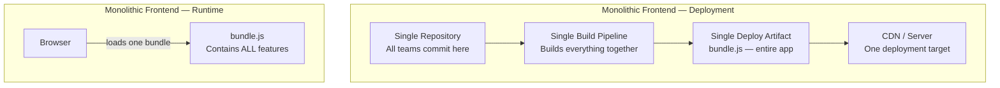
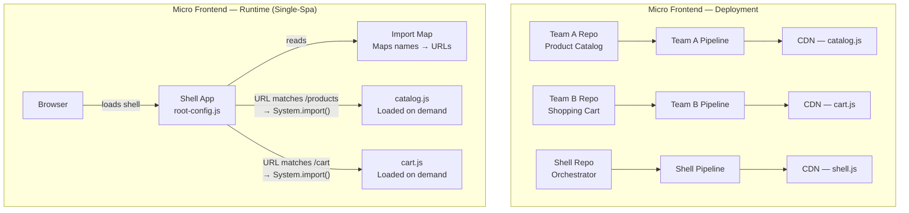
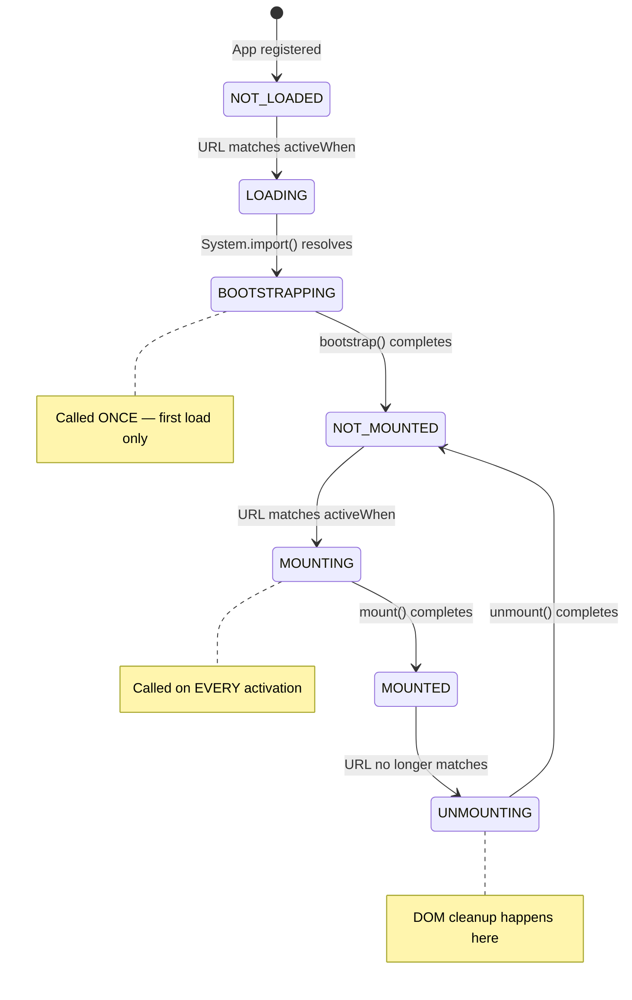

# Single-Spa Micro Frontend Architecture

## Table of Contents

- [Monolith vs Micro Frontend Architecture](#monolith-vs-micro-frontend-architecture)
- [Core Principles of Micro Frontends](#core-principles-of-micro-frontends)
- [Architecture Diagrams](#architecture-diagrams)
- [Single-Spa: When to Choose It and Trade-Offs](#single-spa-when-to-choose-it-and-trade-offs)
- [Interview Preparation: Micro Frontend Fundamentals](#interview-preparation-micro-frontend-fundamentals)
- [Interview Preparation: Single-Spa Specific](#interview-preparation-single-spa-specific)

---

## Monolith vs Micro Frontend Architecture

### What is a Monolithic Frontend?

A monolithic frontend is a single, unified codebase where all features, pages, and components are built, tested, and deployed as one unit. Every team works in the same repository, shares the same build pipeline, and ships the entire application together — even if only one button changed.

### What is a Micro Frontend?

A micro frontend decomposes the frontend into smaller, independently deployable applications. Each "micro frontend" owns a vertical slice of the product (e.g., the checkout flow, the product catalog, the user dashboard) and can be developed, tested, and deployed by a separate team without coordinating with others.

### Comparison Table

| Dimension | Monolithic Frontend | Micro Frontend |
|---|---|---|
| Deployment | Single artifact, all-or-nothing | Each micro frontend deploys independently |
| Team coupling | All teams share one codebase and build | Teams own their slice end-to-end |
| Technology choice | One framework, one version, one build tool | Each team can choose their own stack |
| Build time | Grows with the entire codebase | Each micro frontend builds in isolation |
| Runtime complexity | Simple — one bundle, one app | Higher — orchestration, shared deps, communication |
| Failure blast radius | One bug can break the entire app | Failures are isolated to one micro frontend |

### Advantages of Monolithic Frontend

1. **Simplicity**: One repo, one build, one deploy pipeline. No orchestration layer, no import maps, no cross-app communication protocols. For small teams (< 5 developers), this simplicity is a genuine advantage — you ship faster because there's less infrastructure to manage.

2. **Consistent UX**: Since all code lives together, enforcing a design system, shared state, and consistent navigation is straightforward. There's no risk of two teams shipping conflicting UI patterns because everyone works in the same codebase.

3. **Easier debugging and testing**: Stack traces span the entire application. Integration tests cover real user flows without needing to spin up multiple services. Debugging a bug means looking at one codebase, not tracing events across micro frontend boundaries.

4. **No runtime overhead**: There's no orchestration framework, no dynamic module loading, no shared dependency negotiation. The browser loads one bundle (or a few code-split chunks) and runs it. This means faster initial load and simpler performance profiling.

### Disadvantages of Monolithic Frontend

1. **Deployment bottleneck**: Every change requires deploying the entire application. If Team A's feature is ready but Team B introduced a regression, Team A is blocked. At production scale with 10+ teams, this becomes the dominant source of delivery friction — deploy queues, merge conflicts, and "deploy trains" that ship once a week instead of multiple times a day.

2. **Scaling teams is painful**: As the codebase grows, onboarding slows down, build times increase, and ownership boundaries blur. A 500K-line monolith with 30 contributors leads to constant merge conflicts, unclear code ownership, and "who broke the build?" investigations that waste engineering hours.

3. **Technology lock-in**: Migrating from React 16 to React 18 (or from Angular to React) requires a big-bang rewrite or a long, painful incremental migration where old and new code coexist awkwardly. You can't adopt a better tool for one feature without affecting the entire app.

4. **Slow CI/CD**: Build and test times grow linearly (or worse) with codebase size. A 20-minute build pipeline means developers wait 20 minutes for feedback on every PR, even if they changed one line. This kills developer velocity and encourages batching changes — which increases risk per deploy.

### Advantages of Micro Frontend

1. **Independent deployment**: Each team deploys their micro frontend on their own schedule. The checkout team can ship three times a day while the catalog team ships weekly. No coordination needed, no deploy queues, no blocking on other teams' regressions. This is the single biggest advantage at scale.

2. **Team autonomy and ownership**: Each team owns their micro frontend end-to-end: code, tests, CI/CD pipeline, monitoring. This creates clear accountability ("the cart team owns the cart") and eliminates the diffusion of responsibility that plagues large monoliths.

3. **Technology agnosticism**: Team A can use React, Team B can use Vue, Team C can use Svelte. More practically, teams can upgrade frameworks independently — one team migrates to React 18 while others stay on React 17 until they're ready. This eliminates big-bang migrations.

4. **Fault isolation**: If the recommendations micro frontend crashes, the rest of the page keeps working. Users can still browse products, add to cart, and check out. In a monolith, one unhandled exception in the recommendations module could white-screen the entire application.

### Disadvantages of Micro Frontend

1. **Operational complexity**: You now have N build pipelines, N deployment targets, N sets of monitoring dashboards instead of one. The orchestration layer (Single-Spa, Module Federation) adds configuration that every developer must understand. This overhead only pays off when you have enough teams to justify it.

2. **Performance overhead**: Loading multiple micro frontends means multiple JavaScript bundles, potential duplicate dependencies (two copies of React if sharing isn't configured correctly), and orchestration framework overhead. Without careful optimization, initial page load can be significantly slower than a well-optimized monolith.

3. **Cross-cutting concerns are harder**: Shared authentication, global state, consistent error handling, and unified analytics require explicit contracts between micro frontends. In a monolith, you just import a shared module. In micro frontends, you need event buses, shared stores, or custom events — each with its own coupling and debugging trade-offs.

4. **UX consistency challenges**: When different teams own different parts of the page, visual inconsistencies creep in — different button styles, different loading patterns, different error messages. Enforcing a design system across independently deployed micro frontends requires discipline, shared component libraries, and governance processes.

---

## Core Principles of Micro Frontends

### 1. Independent Deployment

Each micro frontend is built, tested, and deployed as a standalone unit. Deploying one micro frontend does not require rebuilding or redeploying any other micro frontend or the shell application.

**Production Scenario — E-Commerce Platform:**

A large e-commerce company has separate teams for Product Catalog, Shopping Cart, Checkout, and User Account. On Black Friday eve, the Checkout team discovers a critical payment bug. In a monolith, fixing this means deploying the entire application — risking regressions in the catalog, cart, and account features during the highest-traffic period of the year.

With micro frontends, the Checkout team deploys their fix in isolation. The fix goes through their own CI/CD pipeline, their own staging environment, and their own canary rollout. The Product Catalog, Cart, and Account micro frontends are completely untouched. The fix is live in 15 minutes instead of waiting for a coordinated deploy window.

**How Single-Spa enables this:** Each micro frontend is a separate bundle served from its own URL. The shell's import map maps logical names to URLs. Deploying a new version means uploading a new bundle and updating the URL in the import map — no other micro frontend is affected.

### 2. Team Autonomy

Each team owns their micro frontend end-to-end: the code, the build pipeline, the tests, the deployment, and the monitoring. Teams make their own technical decisions without requiring approval from a central architecture board.

**Production Scenario — Financial Services Dashboard:**

A financial services company has a Risk Analytics team and a Portfolio Management team. The Risk team needs real-time streaming data and chooses to use RxJS heavily with a custom WebSocket layer. The Portfolio team works with mostly static data and prefers a simpler React Query + REST approach.

In a monolith, these teams would fight over the data-fetching strategy — one approach would win, and the other team would be forced to use a pattern that doesn't fit their domain. With micro frontends, each team uses the data-fetching approach that best fits their problem. The Risk micro frontend uses RxJS; the Portfolio micro frontend uses React Query. Neither team needs to know or care about the other's implementation.

**How Single-Spa enables this:** Single-Spa's only contract is the lifecycle interface (`bootstrap`, `mount`, `unmount`). As long as a micro frontend exports these three functions, Single-Spa doesn't care what happens inside. Teams can use any framework, any state management library, any build tool.

### 3. Technology Agnosticism

The architecture does not mandate a specific framework, library version, or build tool. Different micro frontends can use different technologies, and the system composes them into a unified user experience.

**Production Scenario — Legacy Migration at a Media Company:**

A media company has a 5-year-old Angular.js application with 200K lines of code. A full rewrite to React would take 18 months and freeze feature development. Instead, they adopt micro frontends:

- The existing Angular.js code becomes one micro frontend (the "legacy" app)
- New features are built as React micro frontends
- Single-Spa orchestrates both, routing between Angular.js pages and React pages seamlessly
- Over 12 months, the team incrementally migrates Angular.js pages to React micro frontends
- Each migration is a small, low-risk deployment — not a big-bang rewrite

Users never notice the transition. The URL `/articles` might serve the Angular.js micro frontend today and the React micro frontend tomorrow, with zero downtime.

**How Single-Spa enables this:** Single-Spa has framework-specific adapter libraries (`single-spa-react`, `single-spa-angular`, `single-spa-vue`) that translate each framework's rendering model into the standard lifecycle interface. The shell doesn't know or care which framework a micro frontend uses — it just calls `mount()` and `unmount()`.

---

## Architecture Diagrams

### Monolith vs Micro Frontend — Deployment and Runtime

### Single-Spa Lifecycle Flow

---

## Single-Spa: When to Choose It and Trade-Offs

### When Single-Spa is the Right Choice

- **You need to compose micro frontends built with different frameworks.** Single-Spa's adapter libraries (`single-spa-react`, `single-spa-angular`, `single-spa-vue`) let you run React, Angular, and Vue apps side by side on the same page. If your organization has teams on different frameworks — especially during a migration — Single-Spa is purpose-built for this.

- **You want explicit lifecycle management.** Single-Spa gives you fine-grained control over when apps bootstrap, mount, and unmount. You can add global error handlers, DOM cleanup verification, and custom loading states. If you need to understand and control exactly what happens during route transitions, Single-Spa's lifecycle model is transparent and debuggable.

- **You're migrating incrementally from a monolith.** Single-Spa lets you wrap your existing monolith as one micro frontend and build new features as separate micro frontends. The shell routes between the legacy app and new apps. Over time, you carve out pieces of the monolith into their own micro frontends.

- **Your micro frontends are route-based (one app per URL path).** Single-Spa's `activeWhen` routing model maps cleanly to "this URL path belongs to this team's app." If your architecture is "the /checkout path is owned by the Checkout team," Single-Spa's model fits naturally.

### When Single-Spa is NOT the Right Choice

- **You need runtime code sharing between micro frontends.** Single-Spa doesn't handle code sharing — each micro frontend is a separate bundle loaded independently. If you need micro frontends to share components or libraries at runtime (not just via CDN), Module Federation is a better fit.

- **All your micro frontends use the same framework and version.** If everyone is on React 18 with Webpack 5, Module Federation gives you runtime code sharing, singleton dependency management, and component-level composition without the overhead of SystemJS and import maps.

- **You need component-level composition (not page-level).** Single-Spa's primary model is "one app per route." While it supports parcels (mounting an app inside another app), this is more complex than Module Federation's `import('remote/Component')` pattern for embedding components from other apps.

### Trade-Offs Summary

| Dimension | Single-Spa | Module Federation |
|---|---|---|
| Composition model | Page-level (route-based) | Component-level (import-based) |
| Framework mixing | First-class support via adapters | Possible but not the primary use case |
| Code sharing | None built-in (use CDN or import maps) | Runtime sharing via shared config |
| Module system | SystemJS + import maps | Webpack's native module system |
| Build tool coupling | Framework-agnostic (any bundler) | Tightly coupled to Webpack 5 |
| Lifecycle control | Explicit (bootstrap/mount/unmount) | Implicit (React.lazy + Suspense) |
| Learning curve | Moderate — new concepts (lifecycles, import maps) | Moderate — webpack plugin config, async boundaries |
| Production maturity | Battle-tested at scale (IKEA, Spotify) | Widely adopted, growing ecosystem |

---

## Interview Preparation: Micro Frontend Fundamentals

### Q1: What problem do micro frontends solve, and when would you NOT use them?

**Model Answer:**

Micro frontends solve the organizational scaling problem. When you have multiple teams working on the same frontend, a monolith creates coupling: shared build pipelines, coordinated deployments, merge conflicts, and technology lock-in. Micro frontends let each team deploy independently, own their code end-to-end, and choose their own tools.

I would NOT use micro frontends when:
- The team is small (fewer than 3-4 frontend developers). The operational overhead of multiple build pipelines, orchestration configuration, and cross-app communication outweighs the benefits.
- The application is tightly integrated — for example, a real-time collaborative editor where every component needs shared state with sub-millisecond updates. The communication overhead between micro frontends would be prohibitive.
- The organization doesn't have the DevOps maturity to manage multiple deployment pipelines and monitoring dashboards.

The key insight: micro frontends are an organizational pattern, not a technical one. You adopt them when team independence is more valuable than the simplicity of a monolith.

### Q2: How do you handle shared state across micro frontends? What are the trade-offs of each approach?

**Model Answer:**

There are three main approaches, each with different coupling characteristics:

1. **Custom browser events** (`CustomEvent` API): The loosest coupling. Micro frontends dispatch events on `window` and listen for events from others. Trade-off: fire-and-forget semantics mean you can't guarantee delivery, and debugging event flows across apps is difficult. Best for: notifications, analytics events, non-critical UI updates.

2. **Shared event bus (pub/sub)**: A shared JavaScript module that micro frontends import. Provides `subscribe()`, `publish()`, and `unsubscribe()`. Tighter coupling than custom events (all apps depend on the bus module) but more structured. Trade-off: the bus is a shared dependency that must be versioned carefully. Best for: structured cross-app communication with defined event contracts.

3. **Shared state store**: A simple observable store (like a minimal Redux) that micro frontends read from and write to. Tightest coupling — all apps share the same state shape. Trade-off: changes to the state shape can break multiple micro frontends simultaneously. Best for: truly shared data like user authentication state, shopping cart contents, or feature flags.

My recommendation: use the loosest coupling that meets your needs. Start with custom events. If you need guaranteed delivery or complex event flows, move to an event bus. Only use a shared store for data that genuinely needs to be synchronized across apps in real time.

### Q3: How do you ensure consistent UX across independently deployed micro frontends?

**Model Answer:**

Three layers of defense:

1. **Shared component library**: Publish a versioned design system as an npm package (or a Module Federation remote). All micro frontends consume it. The key is versioning — use semver and allow micro frontends to upgrade at their own pace. Don't force all apps to use the same version simultaneously, or you've recreated the monolith's coupling.

2. **Design tokens**: Extract colors, spacing, typography, and breakpoints into CSS custom properties or a shared token file. Even if micro frontends use different component libraries, they can share the same visual language through tokens.

3. **Visual regression testing**: Run automated screenshot comparisons (Chromatic, Percy, BackstopJS) across all micro frontends in CI. This catches visual inconsistencies before they reach production.

The organizational layer matters too: a "platform" or "design systems" team that owns the shared library and reviews cross-app UX consistency. Without governance, technical solutions alone won't prevent drift.

### Q4: What are the performance implications of micro frontends, and how do you mitigate them?

**Model Answer:**

The main performance risks are:

1. **Duplicate dependencies**: If each micro frontend bundles its own copy of React, you're shipping React N times. Mitigation: use shared dependency strategies — CDN-hosted singletons (Single-Spa approach) or Module Federation's `shared` config with `singleton: true`.

2. **Waterfall loading**: The shell loads → parses → discovers which micro frontend to load → fetches it → parses → renders. Each step is sequential. Mitigation: preload micro frontend bundles using `<link rel="preload">`, use import map overrides to point to pre-cached bundles, or use Module Federation's eager loading for critical-path apps.

3. **Orchestration overhead**: The shell framework (Single-Spa, SystemJS) adds JavaScript that must be parsed and executed before any micro frontend renders. Mitigation: keep the shell minimal, load the orchestration library from CDN with caching, and measure the overhead — it's typically 10-30KB gzipped, which is acceptable for most applications.

4. **Layout shifts**: If micro frontends load asynchronously, the page layout can shift as apps mount. Mitigation: reserve space for each micro frontend's container with CSS (min-height), show skeleton loaders during loading, and use `<Suspense>` fallbacks.

I'd measure performance with Core Web Vitals (LCP, FID, CLS) and set budgets per micro frontend. If a micro frontend exceeds its performance budget, the owning team is responsible for optimizing it.

### Q5: How do you handle routing in a micro frontend architecture? Who owns the routes?

**Model Answer:**

There are two strategies, and the choice depends on your team structure:

1. **Shell-level routing**: The shell owns all top-level routes and maps each route to a micro frontend. The micro frontend doesn't know about routing — it just renders when mounted. This is Single-Spa's default model (`activeWhen: ['/products']`). Advantage: centralized route registry, easy to reason about. Disadvantage: adding a new route requires changing the shell, which creates a coupling point.

2. **App-level routing**: Each micro frontend owns its own sub-routes. The shell routes `/products/*` to the Products micro frontend, and the Products app internally handles `/products/list`, `/products/:id`, `/products/:id/reviews`. Advantage: teams have full autonomy over their URL structure. Disadvantage: deep linking and cross-app navigation require coordination.

In practice, I'd use a hybrid: the shell owns top-level route prefixes (one per micro frontend), and each micro frontend owns its sub-routes. This gives teams autonomy within their URL namespace while keeping the top-level routing centralized and predictable.

### Q6: How do you test micro frontends? What's your testing strategy?

**Model Answer:**

I use a three-level testing pyramid adapted for micro frontends:

1. **Unit tests (per micro frontend)**: Each team tests their micro frontend in isolation using Jest + React Testing Library (or their framework's equivalent). These tests run in the team's own CI pipeline and cover component behavior, business logic, and edge cases. Fast feedback, high coverage.

2. **Integration tests (cross-micro-frontend)**: Test the communication contracts between micro frontends. If the Cart micro frontend dispatches a `cart:updated` event, write a test that verifies the Header micro frontend updates the cart count. These tests use a shared test harness that mounts multiple micro frontends together. Slower, but catches contract violations.

3. **End-to-end tests (composed application)**: Cypress or Playwright tests that run against the fully composed application (shell + all micro frontends). These test real user flows: "add a product to cart, navigate to checkout, complete payment." Run in a staging environment that mirrors production. Slowest, but highest confidence.

The key insight: unit tests are owned by each team. Integration and E2E tests are owned by a platform team or shared across teams. The testing pyramid still applies — most tests should be unit tests, fewer integration tests, and even fewer E2E tests.

---

## Interview Preparation: Single-Spa Specific

### Q7: Explain Single-Spa's lifecycle hooks. What happens internally when a user navigates between routes?

**Model Answer:**

Single-Spa manages each micro frontend through a state machine with three lifecycle hooks:

- **`bootstrap(props)`**: Called exactly once, the first time the micro frontend is loaded. This is where you do one-time initialization — loading configuration, establishing WebSocket connections, initializing analytics SDKs. It receives props including any `customProps` from `registerApplication()`. Must return a Promise.

- **`mount(props)`**: Called every time the micro frontend should become visible (the URL matches its `activeWhen` condition). For a React app, this is where `ReactDOM.render()` happens — the component tree gets rendered into the DOM container. Called after `bootstrap` on first load, and directly on subsequent activations (the app stays bootstrapped in memory).

- **`unmount(props)`**: Called every time the micro frontend should become invisible (the URL no longer matches). For React, this calls `ReactDOM.unmountComponentAtNode()`, which removes the component tree, runs all cleanup effects, and leaves the DOM container empty.

Here's what happens step by step when a user navigates from `/home` to `/dashboard`:

1. User clicks the `/dashboard` link, which calls `history.pushState()` and dispatches a `popstate` event
2. Single-Spa intercepts the `popstate` event and re-evaluates all registered apps' `activeWhen` conditions
3. `app-react-home`'s `activeWhen: ['/home']` no longer matches → Single-Spa calls its `unmount()`
4. `unmount()` removes the Home component from the DOM container, cleans up React state and effects
5. Single-Spa fires `single-spa:before-mount-routing-event` (the container should be empty now)
6. `app-react-dashboard`'s `activeWhen: ['/dashboard']` now matches → Single-Spa calls its `mount()` (and `bootstrap()` first if this is the first activation)
7. `mount()` renders the Dashboard component into the now-empty DOM container
8. Single-Spa fires `single-spa:routing-event` to signal the transition is complete

The critical detail: unmounts happen BEFORE mounts. Single-Spa guarantees the outgoing app is fully cleaned up before the incoming app starts rendering. This prevents DOM conflicts and ensures a clean handoff.

### Q8: How does Single-Spa handle errors in micro frontends? What happens if a lifecycle hook throws?

**Model Answer:**

Single-Spa has a built-in error handling system with multiple layers:

1. **Lifecycle error states**: If a lifecycle hook (`bootstrap`, `mount`, or `unmount`) throws an error or returns a rejected Promise, Single-Spa transitions the app to a `SKIP_BECAUSE_BROKEN` state. The app won't be mounted again until the page is reloaded. This prevents a broken app from repeatedly crashing on every route change.

2. **Global error handler**: You register error handlers with `addErrorHandler(callback)`. The callback receives an error object with `appOrParcelName` (which app broke), the error message, and the stack trace. This is where you'd log to Sentry, show a user-facing error message, or attempt recovery.

3. **Framework-level error boundaries**: Libraries like `single-spa-react` support an `errorBoundary` option that catches React rendering errors. This handles errors WITHIN the mounted app (e.g., a component throws during render) as opposed to lifecycle errors (e.g., `mount()` itself fails).

In our implementation (see `root-config/src/index.js`), we add a global error handler that logs the error and performs emergency DOM cleanup. If `unmount()` fails mid-cleanup, the container might have residual DOM nodes. Our error handler detects this and clears the container to prevent the next app from mounting into a dirty state.

The defense-in-depth approach: framework error boundaries catch rendering errors → Single-Spa catches lifecycle errors → global error handler catches everything else → DOM cleanup verification catches residual state.

### Q9: What are the alternatives to SystemJS for loading micro frontends in Single-Spa, and why might you choose one over another?

**Model Answer:**

Single-Spa supports multiple loading strategies:

1. **SystemJS + import maps** (what we use in this project): The classic Single-Spa approach. Import maps provide a clean abstraction — logical names map to URLs, and you can change URLs without changing code. Trade-off: SystemJS adds ~15KB to the initial load, and import maps are an additional concept developers must learn.

2. **Native ES modules + import maps**: Modern browsers support import maps natively (Chrome 89+, Edge 89+, Safari 16.4+). You can use `import()` instead of `System.import()` and native `<script type="importmap">` instead of SystemJS. Trade-off: browser support isn't universal yet, and you lose SystemJS's polyfill capabilities.

3. **Module Federation**: Instead of SystemJS, use Webpack 5's Module Federation to load micro frontends. The shell's webpack config declares `remotes`, and micro frontends are loaded via `import('remoteName/module')`. Trade-off: tightly couples you to Webpack, but gives you runtime code sharing for free. This is the Hybrid approach covered in the `Hybrid/` directory.

4. **Dynamic script tags**: The simplest approach — inject `<script>` tags that load micro frontend bundles, which register themselves on a global variable. Trade-off: no module system, no dependency management, but zero framework overhead. Works for simple cases.

My recommendation depends on the constraints: if you need broad browser support and framework mixing, SystemJS is proven. If you're all-in on modern browsers, native ES modules are cleaner. If you want code sharing, Module Federation (Hybrid approach) gives you the best of both worlds.

### Q10: You're tasked with migrating a large Angular monolith to micro frontends using Single-Spa. Walk me through your migration strategy.

**Model Answer:**

I'd use the "strangler fig" pattern — gradually replacing the monolith piece by piece, never doing a big-bang rewrite:

**Phase 1 — Wrap the monolith (Week 1-2):**
Set up a Single-Spa shell (root-config) and wrap the entire Angular monolith as a single micro frontend using `single-spa-angular`. The shell routes ALL paths to the Angular app. At this point, the user experience is identical — we've just added the orchestration layer.

**Phase 2 — Extract the first micro frontend (Week 3-6):**
Pick a low-risk, well-bounded feature (e.g., the user profile page). Build it as a new React micro frontend. Update the shell to route `/profile` to the new React app and everything else to the Angular monolith. The Angular app's router is configured to ignore `/profile`. Now two apps coexist.

**Phase 3 — Establish patterns (Week 6-10):**
Extract 2-3 more features. This is where you establish shared patterns: how micro frontends communicate (event bus? shared store?), how they share authentication state, how the design system works across Angular and React. Document these patterns for other teams.

**Phase 4 — Scale extraction (Ongoing):**
Other teams start extracting their features into micro frontends. Each extraction follows the established patterns. The Angular monolith shrinks over time. Teams choose their own pace — there's no deadline to "finish" the migration.

**Phase 5 — Retire the monolith (Eventually):**
When the last feature is extracted, the Angular micro frontend is deregistered. The monolith is gone, replaced by a collection of independently deployed micro frontends.

Key principles: never freeze feature development during migration, always keep the application working (users don't notice the migration), and let teams migrate at their own pace. The strangler fig pattern works because it's incremental and reversible — if a micro frontend extraction goes wrong, you can route back to the monolith.
